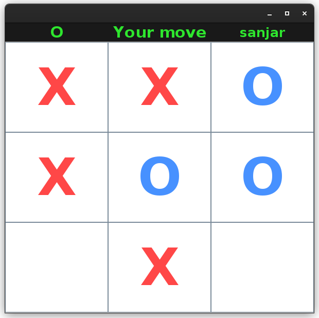
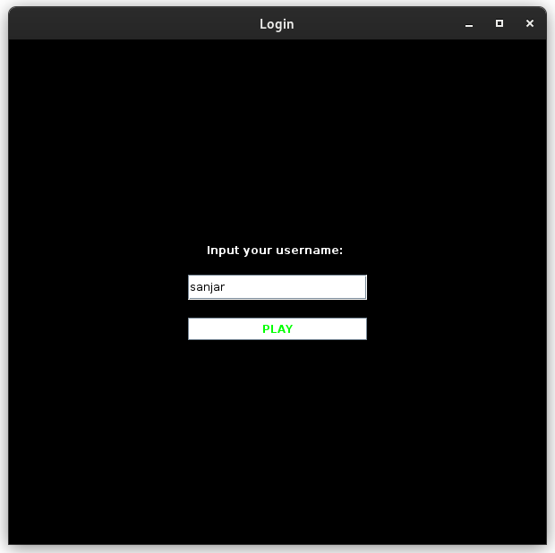
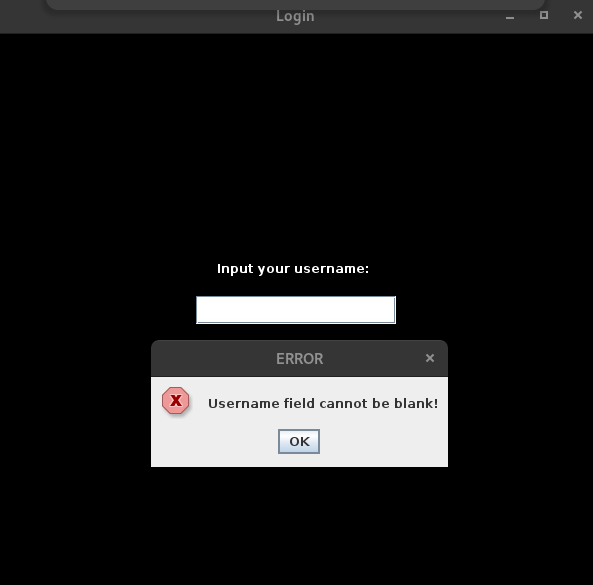
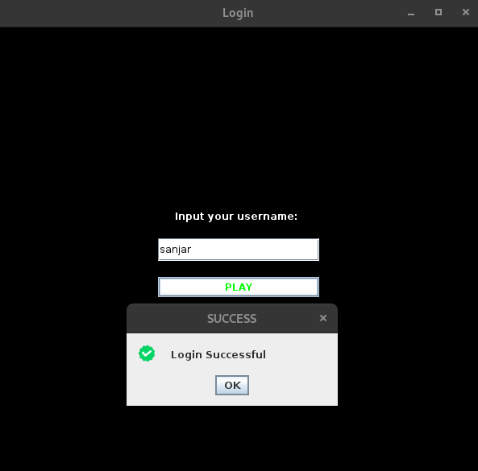
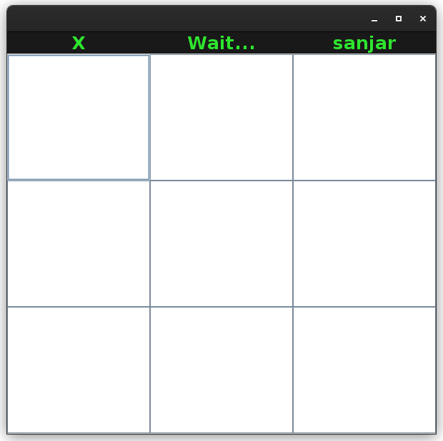
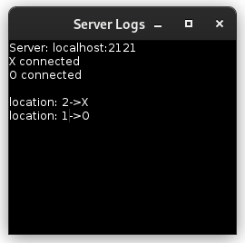

# **🎲 Iks-nolik**

<p align="center">
    
</p>

> [!NOTE]
> The multiplayer edition **Tic-Tac-Toe** game, made using Java SWING.
>
> - Sanjar Zayniev (`U2210264`)
> - Abduaziz Ziyodov (`U2210265`)

## **💫 Client**

> Author: Sanjar Zayniev (`U2210264`)

Dependencies:

- Java SWING
- OpenJDK 17.0.8
- OpenJDK Runtime Environment
- OpenJDK 64-Bit Server VM
- Assets like `icons` and `sound` effects

## **🚀 How to Run?**

Using terminal:

```shell
$ java src/Client.java
```

> [!IMPORTANT]
> You should configure your environment. There are many imports from internal modules, you should specify your classpath. Otherwise, it will not run properly. It is better to use some `IDE` which will do it for you.

## **🔓 Login Screen**

<p align="center">
    
</p>

Simple, minimalistic. It can handle exceptions:

<p align="center">
    
</p>

✅ Successful login:

<p align="center">
    
</p>

## **Game frame**

<p align="center">
    
</p>

The game will not start until the opponent connects. `X` is the mark of the current player, `Wait...` status text sent by the server and `sanjar` is the name of the current user.

> [!NOTE]
> The server should be started before the client.

> [!TIP]
> You wanna play with your friend, and you are not in the same network? No problem, install `ngrok` or `jprq`, open tunnel. Change server host and port from `Settings.java` and enjoy! (Dragunov).


## **Server**

> Author: Abduaziz Ziyodov (`U2210265`)

Dependencies:

- PostgreSQL (16)
- OpenJDK 17.0.8
- OpenJDK Runtime Environment
- OpenJDK 64-Bit Server VM
- PostgreSQL Driver For Java (`*.jar` file)
- Java SWING

## **🚀 How to Run?**

Using terminal:

```shell
$ java src/Server.java
```

If Postgres driver does not exist on your Java classpath, you should specify it:

```shell
$ java -cp lib/postgresql-42.7.0.jar src/Server.java
```

TCP(not UDP) server is running on host `localhost` and port `2121`:

<p align="center">
    
</p>

> [!TIP]
> Instead of running `Client.java`, you can use tools like `netcat` or `telnet`. But you will not have a beautiful `GUI`.

If a client connects:

<p align="center">
    
</p>

> [!IMPORTANT]
> If the game ends, you need to restart both `Server.java` and `Client.java`.

> [!NOTE]
> Server will control the entire game, GUI should handle and represent it. There are several types of server-side events to control the game:
* `wait` - blocks client interaction with GUI.
* `your_move` - unblocks a client.
* `your_mark` - after successful login, the server will send the client's mark (X or O).
* `opponent_moved` - event for synchronizing current players board with opponent's.
* `valid_move` and `invalid_move` - status of last move.
* `victory` and `defeat` - each of the clients will get their own (e.g. if (1) gets `victory`, (2) should get `defeat`).
* `draw` - friendship.
